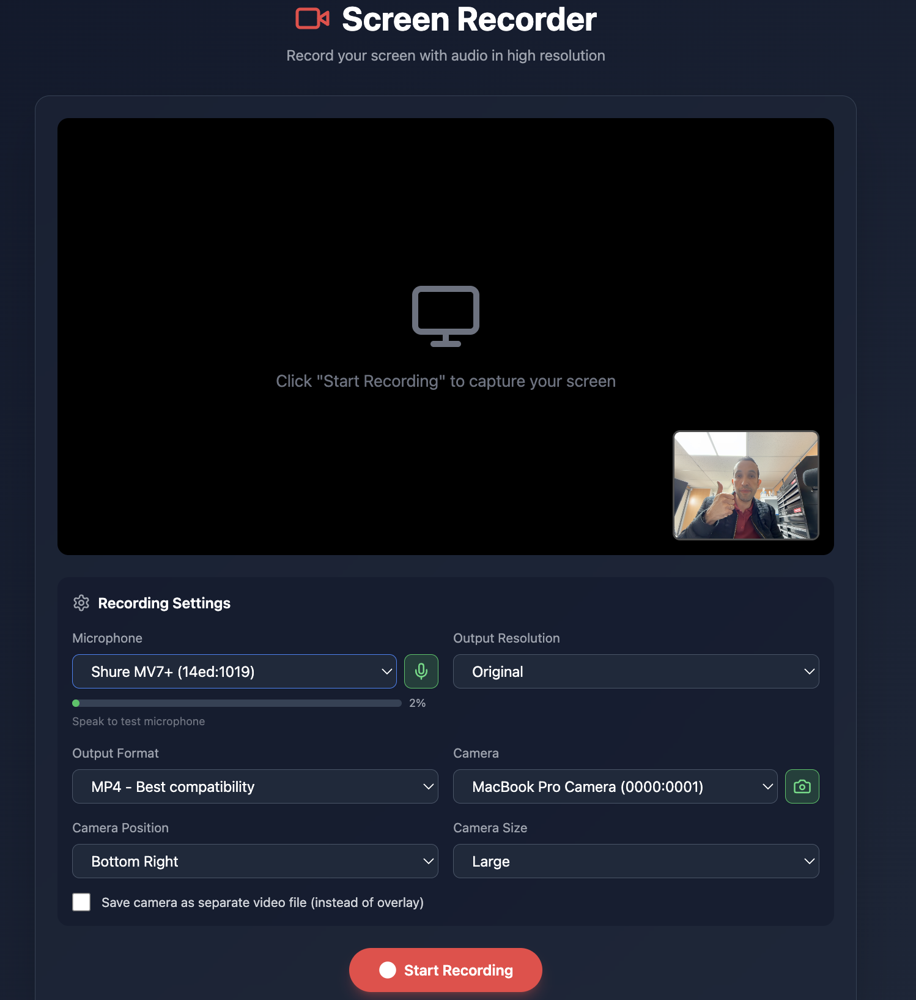

# 🎬 Screen Recorder Web App

A modern, feature-rich web-based screen recorder with camera overlay support, multiple output formats, and professional-grade recording capabilities.



---

## ✨ Features

### 🖥️ Screen Recording
- **Full Screen Capture** - Record your entire screen, specific window, or browser tab
- **High Resolution** - Up to 4K resolution at 60fps
- **System Audio** - Captures system audio when available
- **Pause/Resume** - Control your recording without stopping
- **Live Preview** - Watch your screen while recording

### 🎤 Audio
- **Microphone Selection** - Choose from available audio input devices
- **Real-time Level Meter** - Visual indicator showing microphone activity
- **Audio Mixing** - Combines system audio with microphone input
- **Noise Suppression** - Built-in echo cancellation and noise reduction

### 📷 Camera (Webcam)
- **Camera Selection** - Choose from available cameras
- **Live Preview** - See your camera feed before recording
- **Picture-in-Picture Overlay** - Embed camera on screen recording
- **Adjustable Position** - Place overlay in any corner
- **Adjustable Size** - Small, Medium, Large, or Extra Large
- **Separate Recording** - Save camera as independent video file

### 📁 Output Options
- **Multiple Formats** - MP4, WebM, MOV, MKV, AVI
- **Resolution Control** - Original, 720p, 1080p, 1440p, 4K
- **FFmpeg Powered** - Professional-grade video conversion

---

## 🚀 Getting Started

### Prerequisites

Before installing, make sure you have the following installed on your system:

#### 1. Node.js (v18 or higher)

**macOS (using Homebrew):**
```bash
brew install node
```

**Ubuntu/Debian:**
```bash
curl -fsSL https://deb.nodesource.com/setup_20.x | sudo -E bash -
sudo apt-get install -y nodejs
```

**Windows:**
Download and install from [nodejs.org](https://nodejs.org/)

Verify installation:
```bash
node --version  # Should show v18.x.x or higher
npm --version   # Should show 9.x.x or higher
```

#### 2. FFmpeg (required for video conversion)

**macOS (using Homebrew):**
```bash
brew install ffmpeg
```

**Ubuntu/Debian:**
```bash
sudo apt update
sudo apt install ffmpeg
```

**Windows:**
1. Download from [ffmpeg.org](https://ffmpeg.org/download.html)
2. Extract to `C:\ffmpeg`
3. Add `C:\ffmpeg\bin` to your PATH environment variable

Verify installation:
```bash
ffmpeg -version
```

---

### Installation

1. **Clone the repository:**
```bash
git clone https://github.com/jrterven/screen_recorder.git
cd screen_recorder
```

2. **Install dependencies:**
```bash
npm install
```

3. **Start the development server:**
```bash
npm run dev
```

4. **Open in your browser:**
```
http://localhost:5173
```

> **Note:** The app runs two servers:
> - **Frontend** (Vite): `http://localhost:5173`
> - **Conversion Server** (Express): `http://localhost:3001`

---

### Build for Production

```bash
# Build the frontend
npm run build

# Preview the production build
npm run preview
```

---

## 📖 Usage Guide

### Basic Recording

1. **Open the app** at `http://localhost:5173`
2. **Configure settings:**
   - Select your microphone (green level bar shows audio activity)
   - Enable camera if needed
   - Choose output format and resolution
3. **Click "Start Recording"**
4. **Select what to share** (entire screen, window, or tab)
5. **Record your content**
6. **Click the big red "STOP RECORDING" button** when done
7. **Preview and download** your recording

### Recording with Camera Overlay

1. Enable the camera toggle (green icon)
2. Choose camera position (corner placement)
3. Select camera size (15%-30% of screen)
4. Start recording - camera will be embedded in the video

### Recording Camera Separately

1. Enable camera
2. Check **"Save camera as separate video file"**
3. Record as normal
4. After stopping, use **"Play Both (Synced)"** to preview
5. Click **"Download Both Recordings"** to save both files

---

## ⚙️ Settings Reference

| Setting | Options | Description |
|---------|---------|-------------|
| **Microphone** | Device list + toggle | Audio input with real-time level meter |
| **Output Resolution** | Original, 720p, 1080p, 1440p, 4K | Final video resolution |
| **Output Format** | MP4, WebM, MOV, MKV, AVI | Video container format |
| **Camera** | Device list + toggle | Video input device |
| **Camera Position** | 4 corners | Overlay placement |
| **Camera Size** | Small/Medium/Large/XL | 15%, 20%, 25%, or 30% of screen |
| **Separate Recording** | Checkbox | Save camera as independent file |

---

## 🌐 Browser Support

| Browser | Screen Capture | System Audio | Camera |
|---------|---------------|--------------|--------|
| **Chrome** | ✅ Full | ✅ Full | ✅ Full |
| **Edge** | ✅ Full | ✅ Full | ✅ Full |
| **Firefox** | ✅ Full | ⚠️ Limited | ✅ Full |
| **Safari** | ⚠️ Limited | ❌ No | ✅ Full |

---

## 🛠️ Technical Stack

| Component | Technology |
|-----------|------------|
| Frontend | React 18 + Vite |
| Styling | TailwindCSS |
| Icons | Lucide React |
| Backend | Express.js |
| Video Processing | FFmpeg |
| Screen Capture | `getDisplayMedia` API |
| Recording | MediaRecorder API |
| Camera Compositing | HTML5 Canvas |

### Video Quality

- **Screen Recording**: Up to 8 Mbps bitrate
- **Camera Recording**: Up to 4 Mbps bitrate
- **Audio**: 48kHz sample rate
- **Frame Rate**: Up to 60fps

---

## 📁 Project Structure

```
screen_recorder/
├── src/
│   ├── App.jsx          # Main React component
│   ├── main.jsx         # React entry point
│   └── index.css        # Tailwind styles
├── server/
│   └── index.js         # Express server for FFmpeg
├── public/
├── package.json         # Dependencies and scripts
├── vite.config.js       # Vite configuration
├── tailwind.config.js   # Tailwind configuration
├── postcss.config.js    # PostCSS configuration
└── README.md
```

---

## 🔧 Troubleshooting

### "FFmpeg not found" error
Make sure FFmpeg is installed and in your PATH:
```bash
ffmpeg -version
```

### Camera/Microphone not showing
- Check browser permissions for camera and microphone
- Try refreshing the page after granting permissions

### Port already in use
```bash
# Kill existing processes
pkill -f "vite"
pkill -f "node server"

# Restart
npm run dev
```

---

## 📄 License

MIT License - feel free to use this project for personal or commercial purposes.

---

## 🤝 Contributing

Contributions are welcome! Please feel free to submit a Pull Request.

---

Made with ❤️ using React, Vite, and FFmpeg
